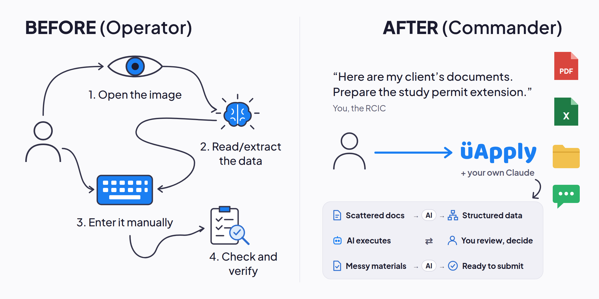
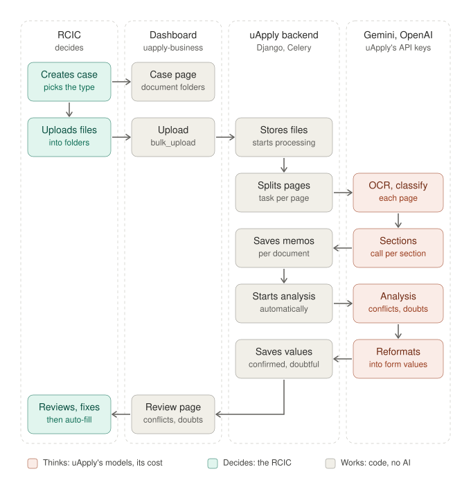
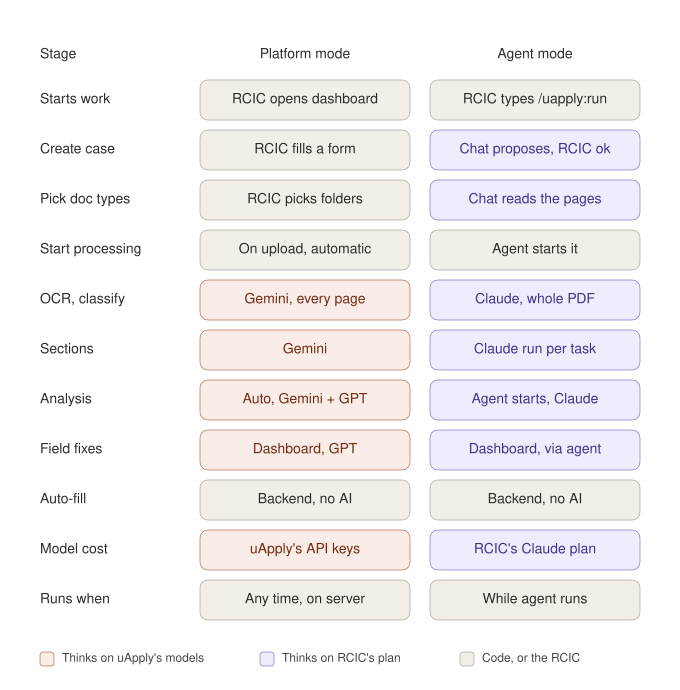

# Overview

## Problem

Today an RCIC drives a uApply case through the web dashboard: create the
survey, upload each document, wait for processing, click through conflicts and
doubtful values, then start auto-fill. Every LLM call is billed to uApply's
Gemini / OpenAI keys.

Many RCICs already have a Claude Code or Codex subscription and keep each
client's documents in a folder on disk. The agent turns that folder into a
finished case, from the tool they already use, on the plan they already pay
for.

## Before and after



The RCIC moves from operator to commander: they give the instruction and make the decisions,
and their own Claude, working through uApply, does the reading and data entry. The agent never
submits anything; the RCIC reviews, signs and submits.

## Goals

1. **Folder in, case out.** `cd ~/Clients/Zhang_Wei && claude` (or `codex`),
   ask for `/uapply:run`, and the agent binds or creates the case, picks the
   document types, uploads, runs processing and analysis, fills the IMM forms
   and reports what is left for the RCIC.
2. **Local tokens.** Every LLM call — vision OCR, classification, section
   extraction, analysis, conflict reasoning — runs on the RCIC's Claude Code or
   Codex plan. uApply's servers make no model calls for that case.
3. **Same results as the web app.** One pipeline, one set of prompts, one data
   model. The agent is an alternative *executor*, not an alternative product.
4. **Works in both Claude Code and Codex** from one codebase.
5. **RCIC stays in control.** Creating a case (which charges the account)
   needs the RCIC's confirmation; the agent never deletes, contacts a client or
   submits; the RCIC reviews the AI Check and submits from the dashboard.
   Approval of legally significant values is planned.

## Non-goals

- Submitting anything to IRCC. Auto-fill produces filled IMM forms / portal
  data; the RCIC submits.
- Replacing the web dashboard. The dashboard remains the review surface; the
  agent writes to the same data.
- Running the backend locally. The agent talks to hosted uApply.
- Supporting arbitrary local models (Ollama etc.). Only the model inside the
  RCIC's Claude Code / Codex session is in scope.

## Architecture in one picture

```
RCIC machine                                               uApply cloud
┌─────────────────────────────────────────────┐            ┌──────────────────────────────────┐
│ Claude Code / Codex  (the LLM)              │            │ Django API + Celery workers      │
│   ├─ uApply playbook (MCP prompts + instr.) │            │                                  │
│   └─ uapply-agent  (stdio MCP server + CLI) │            │ Survey · Document · SurveyValue  │
│        ├─ folder scan / hash / manifest     │── HTTPS ──▶│ PromptTemplate · section routing │
│        ├─ local ops: render pages, text     │            │ AgentTask queue                  │
│        ├─ executor: pull → run → submit     │◀───────────│ prepare/continue + llm_call      │
│        ├─ auto-fill via Acrobat Pro (Win)   │            │ validation · archives · auto-fill│
│        └─ device-code auth (keychain)       │            └──────────────────────────────────┘
│                                             │
│ ~/Clients/Zhang_Wei/                        │
│   passport.pdf  bank_2025.pdf  …            │
│   .uapply/case.json  manifest.json          │
│   uApply output/report.md, final package    │
└─────────────────────────────────────────────┘
```

Three parts:

| Part | Where | Responsibility |
|---|---|---|
| **Backend** | uApply backend | Local-mode cases emit `AgentTask`s (prepare/continue stages for OCR and classification, intercepted `llm_call`s for everything else, D14); task pull/submit endpoints; result validation; status, long-poll, auto-fill and report endpoints for the agent. Review-queue, resolve and approval endpoints with actor + audit, and an auto-fill preflight, are planned. See [local-llm-task-queue.md](architecture/local-llm-task-queue.md). |
| **`uapply-agent`** | Python package, RCIC machine | CLI + stdio MCP server. Owns the working folder, does the non-LLM local work, and is the **task executor**: it pulls tasks and runs each in a fresh headless Claude Code / Codex process. Exposes coarse orchestration tools to the chat model. See [mcp-tools.md](reference/mcp-tools.md). |
| **Playbook** | ships with the package (`src/uapply_agent/SOURCE.md`) | The operator instructions: when to call which tool, where the gates are, how to reason about conflicts. Delivered as MCP prompts and server instructions, so it works in Claude Code, Claude Desktop and Codex from one source. See [playbook.md](reference/playbook.md). |

## Who thinks, who works


| Who | Thinks (AI) | Works (no AI) |
|---|---|---|
| **RCIC** | decides: starts the run, answers questions, approves creating a case, reviews in the dashboard | — |
| **Chat model** (Claude Code / Claude desktop / Codex) | plans the run, reads pages to pick document types, asks the RCIC, reports progress | — |
| **Local agent** (`uapply-agent`) | the headless Claude runs it starts: one per task (OCR, section extraction, analysis, survey values), each with the backend's prompt and none of the chat | renders pages, uploads files, pulls tasks, submits answers |
| **uApply backend** | none for agent cases (D14) | stores files (upload starts nothing), turns each pipeline step into a task with its prompt and answer format, validates every answer, saves the results |

All AI runs on the RCIC's own Claude plan: the chat model orchestrates, the headless runs do the
document work. The backend keeps the rules — prompts, section routing, validation, the data
model — and never calls a model for these cases.

## Platform mode vs agent mode

The same case can run in either mode (`Survey.llm_mode`). Both use the same backend: prompts,
section routing, validation, data model and auto-fill. What differs is who thinks, who pays and what
starts the work.

**Platform mode** — the RCIC works in the dashboard and uApply's own models do the thinking:



**Stage by stage:**



- **Who pays.** Platform mode runs every model call on uApply's Gemini and OpenAI keys. Agent mode
  runs every call on the RCIC's own Claude plan; uApply's servers run no AI for those cases (D14).
- **What starts the work.** Platform mode starts processing on upload and analysis once every
  document is done. Agent mode starts nothing by itself: the agent starts processing, then analysis.
- **How documents are read.** Platform mode splits a PDF into pages and reads each one. Agent mode
  reads the whole PDF once, and a PDF with a text layer needs no model at all (D12).
- **Who picks document types.** In platform mode the RCIC files each upload into a folder. In agent
  mode the chat model looks at the pages and picks the type, asking only when unsure.
- **Availability.** Platform mode works any time, including dashboard edits. Agent mode progresses
  only while the agent runs, and dashboard field fixes on an agent case need an active agent.

## How a case flows

```
RCIC: "/uapply:run"
  1. intake      case_status → no case: preview identity documents → propose name + application type
                   → [RCIC] "Create case" (create_case) or an existing survey id (init_case)
  2. upload      scan_folder → preview unclear files → pick types ([RCIC] only when the pages do not settle it)
                   → sync_documents (hash, skip known files, bulk_upload, manifest)
  3. processing  start_processing → loop run_tasks / wait_for_stage("processing")
                   executor runs each task (OCR, classification, sections) in a fresh headless runtime
                   → server validates
  4. analysis    start_analysis → loop run_tasks / wait_for_stage("analysis")
                   → SurveyValues (CONFIRMED / DOUBTFUL / CONFLICT / MISSING)
  5. finishing   confirm_documents (archives + compression on uApply)
                   → autofill_forms (Acrobat Pro locally, or uApply's platform filler)
                   → final_report (AI Check counts, forms, final package, dashboard links)
  6. RCIC        reviews the AI Check in the dashboard and submits
```

Detailed stage contracts: [case-workflow.md](architecture/case-workflow.md).

## Key properties

- **Waiting on the agent never blocks other customers.** OCR and classification
  hand their tasks to the agent and exit, and the API resumes the pipeline when
  the answers arrive. Every other model call of an agent case waits on the
  dedicated `agent_queue` thread-pool worker (D14), never on a slot other
  customers' documents need. A call nobody picks up fails after 10 minutes;
  re-running `/uapply:run` carries on from the current state.
- **Re-runs are safe.** Re-running `/uapply:run` on the same folder uploads
  nothing twice, re-creates nothing, and carries on from the server's current
  state.
- **Guardrails live in code, not in the prompt.** Result validation and
  evidence checks run server-side; the case-creation confirmation and the
  folder boundary are enforced by the MCP server, regardless of which coding
  agent is driving. See [guardrails.md](design/guardrails.md).
- **Tool results are small.** Evidence snippets and summaries, not raw OCR
  dumps; long jobs are long-polled server-side so the agent's context isn't
  spent on polling.

## Trade-offs accepted

Discussed fully in [decisions.md](design/decisions.md):

- Quality will differ between Gemini (server), Claude and GPT (local); an eval
  set per runtime is mandatory before release.
- Prompt templates become visible on the RCIC's machine (in task payloads,
  never in the chat); a case whose prompts must stay on uApply runs in server
  mode.
- Local execution is more sequential than the server's parallel sections; the
  executor's 2–4 concurrent workers recover most of it, within plan limits.
- Client documents are processed under the RCIC's own Anthropic / OpenAI
  account and terms — a feature for some firms, a compliance question for
  others. Surface it in onboarding.
