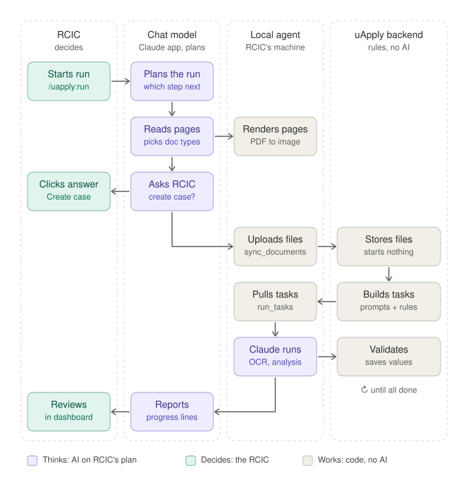

# Overview

## Problem

Today an RCIC drives a uApply case through the web dashboard: create the
survey, upload each document, wait for processing, click through conflicts and
doubtful values, then start auto-fill. Every LLM call is billed to uApply's
Gemini / OpenAI keys.

Many RCICs already have a Claude Code or Codex subscription and keep each
client's documents in a folder on disk. The agent turns that folder into a
finished case, from the tool they already use, on the plan they already pay
for.

## Goals

1. **Folder in, case out.** `cd ~/Clients/Zhang_Wei && claude` (or `codex`),
   ask for `/uapply:run`, and the agent creates the case, uploads, classifies,
   extracts, reconciles and prepares auto-fill.
2. **Local tokens.** Every LLM call — vision OCR, classification, section
   extraction, analysis, conflict reasoning — runs on the RCIC's Claude Code or
   Codex plan. uApply's servers make no model calls for that case.
3. **Same results as the web app.** One pipeline, one set of prompts, one data
   model. The agent is an alternative *executor*, not an alternative product.
4. **Works in both Claude Code and Codex** from one codebase.
5. **RCIC stays in control.** Legally significant decisions and anything that
   leaves the machine are gated behind explicit approval.

## Non-goals

- Submitting anything to IRCC. Auto-fill produces filled IMM forms / portal
  data; the RCIC submits.
- Replacing the web dashboard. The dashboard remains the review surface; the
  agent writes to the same data.
- Running the backend locally. The agent talks to hosted uApply.
- Supporting arbitrary local models (Ollama etc.). Only the model inside the
  RCIC's Claude Code / Codex session is in scope.

## Architecture in one picture

```
RCIC machine                                                uApply cloud
┌─────────────────────────────────────────────┐            ┌─────────────────────────────────┐
│ Claude Code / Codex  (the LLM)              │            │ Django API + Celery workers      │
│   ├─ uApply playbook (MCP prompts+instr.)  │            │                                  │
│   └─ uapply-agent  (stdio MCP server + CLI) │            │  Survey · Document · SurveyValue │
│        ├─ folder scan / hash / manifest     │── HTTPS ──▶│  PromptTemplate · Section routing│
│        ├─ local ops: render pages, text     │            │  AgentTask queue (new)           │
│        ├─ executor: pull → spawn CLI → submit│◀───────────│  prepare/continue stages (new)   │
│        └─ device-code auth (keychain)       │            │  validation · audit · auto-fill  │
│                                             │            └─────────────────────────────────┘
│ ~/Clients/Zhang_Wei/                        │
│   passport.pdf  bank_2025.pdf  …            │            ┌─────────────────────────────────┐
│   .uapply/case.json  manifest.json          │            │ uapply-desktop (existing)        │
│   .uapply/review.md                         │            │ Selenium IMM-form filler         │
└─────────────────────────────────────────────┘            └─────────────────────────────────┘
```

Three parts:

| Part | Where | Responsibility |
|---|---|---|
| **Backend changes** | `uapply-backend` | Prepare/continue split of every LLM-calling step so local-mode cases emit `AgentTask`s; task pull/submit endpoints; result validation; per-value evidence; review-queue, resolve and approval endpoints with actor + audit; auto-fill preflight. See [local-llm-task-queue.md](architecture/local-llm-task-queue.md). |
| **`uapply-agent`** | new package, RCIC machine | CLI + stdio MCP server. Owns the working folder, does the non-LLM local work, and is the **task executor**: it pulls tasks and runs each in a fresh headless Claude Code / Codex process. Exposes coarse orchestration tools to the chat model. See [mcp-tools.md](reference/mcp-tools.md). |
| **Playbook** | new, ships with the package | The operator instructions: when to call which tool, where the gates are, how to reason about conflicts. Delivered as MCP prompts and server instructions, so it works in Claude Code, Claude Desktop and Codex from one source. See [playbook.md](reference/playbook.md). |

## Who thinks, who works



| Who | Thinks (AI) | Works (no AI) |
|---|---|---|
| **RCIC** | decides: starts the run, answers questions, approves creating a case, reviews in the dashboard | — |
| **Chat model** (Claude Code / Claude desktop / Codex) | plans the run, reads pages to pick document types, asks the RCIC, reports progress | — |
| **Local agent** (`uapply-agent`) | the headless Claude runs it starts: one per task (OCR, section extraction, analysis, survey values), each with the backend's prompt and none of the chat | renders pages, uploads files, pulls tasks, submits answers |
| **uApply backend** | none for agent cases (D14) | stores files (upload starts nothing), turns each pipeline step into a task with its prompt and answer format, validates every answer, saves the results |

All AI runs on the RCIC's own Claude plan: the chat model orchestrates, the headless runs do the
document work. The backend keeps the rules — prompts, section routing, validation, the data
model — and never calls a model for these cases.

## How a case flows

```
RCIC: "/uapply:run"
  1. intake     scan folder → propose application type + family → 🧑 confirm → create Survey (+ dependents)
  2. upload     hash files → bulk_upload new ones → manifest
  3. classify   start_document_processing(llm_mode=local_agent)
                  server creates AgentTasks (content extraction, classification)
                  executor runs each task in a fresh headless Claude Code / Codex → server validates
                  low-confidence types → agent double-checks against the file → reclassify
  4. extract    start_analysis(force=true) → AgentTasks per section → SurveyValues (CONFIRMED/DOUBTFUL/CONFLICT/MISSING)
  5. resolve    review queue → agent resolves with evidence (tiered) → 🧑 approve legally significant ones
                  MISSING → client questions drafted in .uapply/review.md (never sent)
  6. auto-fill  preflight (no open CONFLICT) → 🧑 approve → start_auto_filling → desktop filler / L3 JSON
```

Detailed stage contracts: [case-workflow.md](architecture/case-workflow.md).

## Key properties

- **Waiting on the agent never blocks other customers.** OCR and classification
  hand their tasks to the agent and exit, and the API resumes the pipeline when
  the answers arrive. Every other model call of an agent case waits on the
  dedicated `agent_queue` thread-pool worker (D14), never on a slot other
  customers' documents need. A call nobody picks up fails after 10 minutes;
  re-running `/uapply:run` carries on from the current state.
- **Everything is idempotent.** Re-running `/uapply:run` on the same folder
  uploads nothing twice, re-creates nothing, and returns current state for
  already-resolved values.
- **Guardrails live in the API.** Token scope, actor tagging, audit log,
  auto-fill preflight, evidence verification — enforced server-side regardless
  of which coding agent is driving. See [guardrails.md](design/guardrails.md).
- **Tool results are small.** Evidence snippets and summaries, not raw OCR
  dumps; long jobs are long-polled server-side so the agent's context isn't
  spent on polling.

## Trade-offs accepted

Discussed fully in [decisions.md](design/decisions.md):

- Quality will differ between Gemini (server), Claude and GPT (local); an eval
  set per runtime is mandatory before release.
- Prompt templates become visible on the RCIC's machine; keep the most
  sensitive steps server-side if needed (`llm_mode` is per task kind).
- Local execution is more sequential than the server's parallel sections; the
  executor's 2–4 concurrent workers recover most of it, within plan limits.
- Client documents are processed under the RCIC's own Anthropic / OpenAI
  account and terms — a feature for some firms, a compliance question for
  others. Surface it in onboarding.
